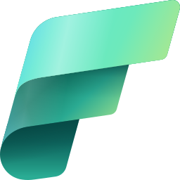

# Fabric Banking Analytics

🚀 Proyecto formativo end-to-end para aprender **Microsoft Fabric** como analista de datos junior, usando datos sintéticos de un banco digital (tipo Revolut).

## 🎯 Objetivos
- Practicar ingesta de datos en **OneLake**.
- Diseñar un **Lakehouse** con capas **Bronze, Silver y Gold**.
- Aplicar **transformaciones PySpark** en notebooks.
- Construir métricas con **SQL endpoints**.
- Crear **dashboards en Power BI** con DAX.
- Aplicar reglas básicas de **Data Quality**.

---

## 📂 Estructura del repositorio

---

## 📊 Datasets sintéticos
1. **customers.csv** → datos de clientes (id, nombre, país, signup, KYC).  
2. **accounts.csv** → datos de cuentas (id, tipo, divisa, estado).  
3. **transactions.csv** → transacciones (monto, merchant, categoría, fecha).  
4. **fx_rates.json** → tipos de cambio EUR/USD/GBP.

---

## 🔄 Flujo de trabajo
1. **Bronze Layer** → ingesta cruda de CSV/JSON a Delta tables.  
2. **Silver Layer** → limpieza de tipos, joins y creación de `dim_customer`, `dim_account`, `fact_transaction`.  
3. **Gold Layer** → agregados de negocio (`gold_country_month`, `gold_category_month`).  
4. **Data Quality** → validaciones simples (nulos, dominios, montos no negativos).  
5. **SQL Endpoint** → creación de vistas y consultas de KPIs.  
6. **Power BI** → dashboard con medidas DAX (volumen, ARPU, churn, MAU).

---

## 📈 KPIs
- **Volumen total** de transacciones.  
- **Clientes activos mensuales**.  
- **Ticket medio** por categoría.  
- **Churn 90 días** (% clientes perdidos).  
- **ARPU** (Average Revenue per User).  

---

## 🚀 Cómo usar este repo
1. Crear un **Workspace** en Microsoft Fabric.  
2. Crear un **Lakehouse** y subir los datasets (`data/`).  
3. Importar el notebook desde `notebooks/`.  
4. Ejecutar paso a paso (Bronze → Silver → Gold).  
5. Correr el script SQL en el **SQL endpoint**.  
6. Crear un reporte en Power BI y pegar las medidas DAX.  

---

## 🛠️ Tecnologías
- **Microsoft Fabric** (Lakehouse, Notebooks, SQL Endpoint, Power BI, Pipelines).  
- **PySpark** para ETL.  
- **SQL** para métricas.  
- **DAX** para visualizaciones.  

---

## 👤 Autor
Proyecto diseñado como formación práctica para analistas junior en **data & analytics para banca digital**.
